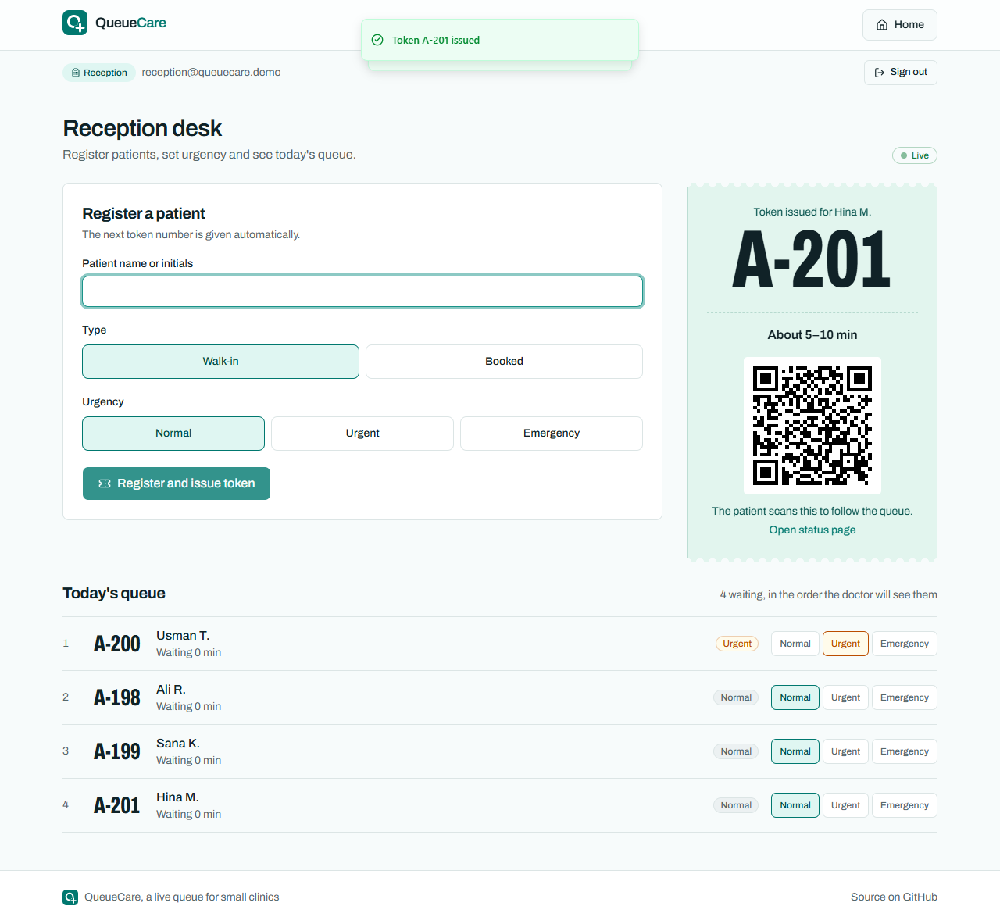
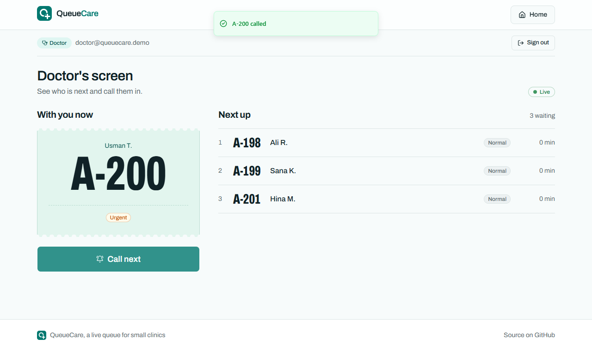
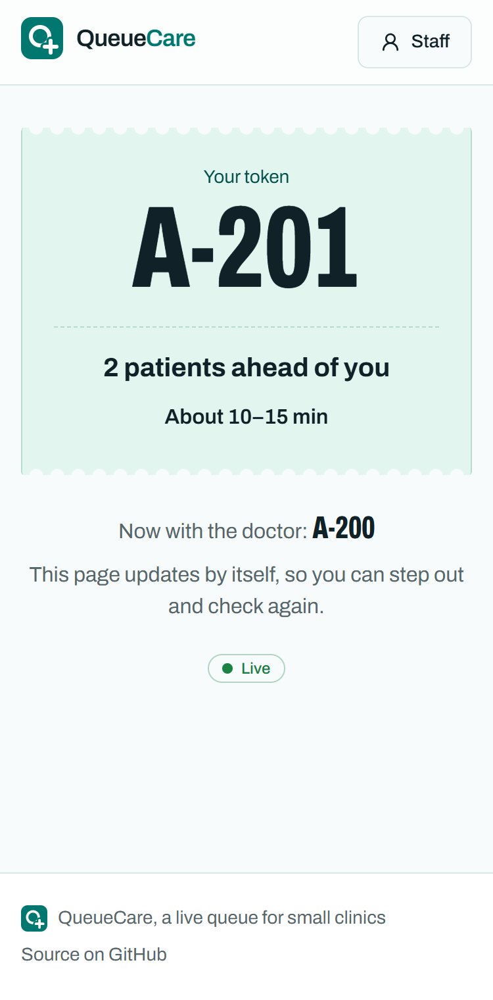
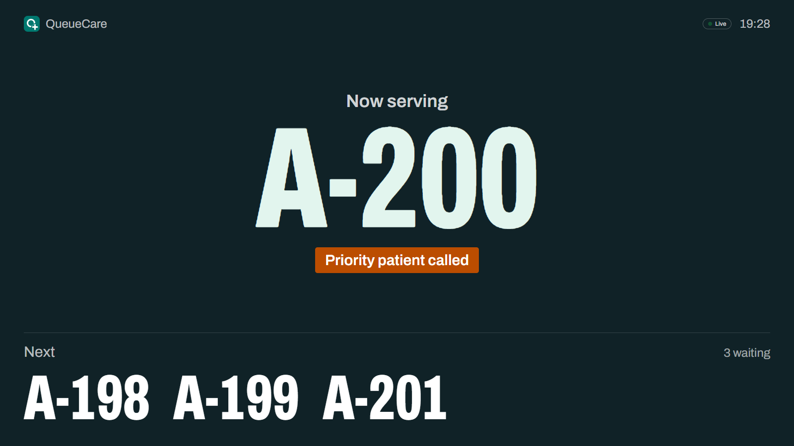
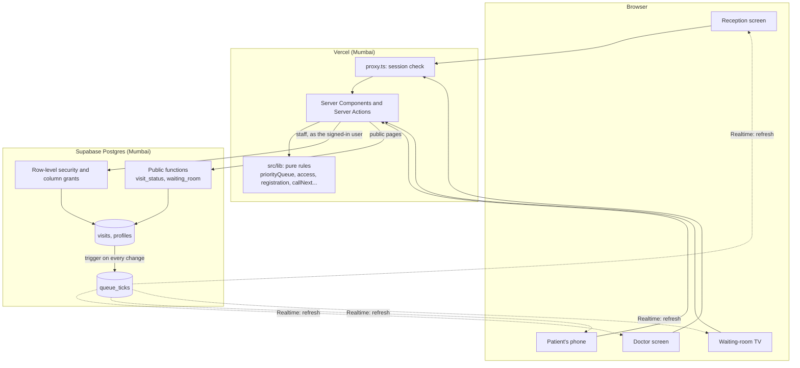

# QueueCare

> Patients at small clinics in Lahore get a paper token and no idea how long they'll wait, so they stay glued to the waiting room and the receptionist answers "how much longer?" all evening. QueueCare is a live clinic queue: urgent patients are seen first, everyone else keeps their place, and every patient can follow the queue on their own phone.

[](https://github.com/ahmed-malikk/QueueCare/actions/workflows/test.yml)

**Live:** [queuecare-zeta.vercel.app](https://queuecare-zeta.vercel.app) · **PRD:** [docs/PRD.md](docs/PRD.md) · **BRD:** [docs/BRD.md](docs/BRD.md) · **Tests:** [plan](docs/test-plan.md) · [report](docs/test-report.md) · **Pilot:** [plan](docs/pilot-plan.md) · **Lessons:** [lessons learned](docs/lessons-learned.md) · **Board:** [project](https://github.com/users/ahmed-malikk/projects/1)



**Try it in a minute (demo data, public accounts):** open the live site, press **Staff**, then **Try as Reception** and **Sign in**. Register a patient and scan the QR code with your phone. In a second window, sign in with **Try as Doctor** and press **Call next**; the reception screen, the patient's phone and the [waiting-room display](https://queuecare-zeta.vercel.app/display) all change by themselves.

| Login | Email | Password |
|---|---|---|
| Reception | `reception@queuecare.demo` | `QueueCare-Reception-1` |
| Doctor | `doctor@queuecare.demo` | `QueueCare-Doctor-1` |

## Why I built it

I interviewed a clinic receptionist and three patients in Lahore ([findings](docs/research/interview-findings.md)). All four said the worst part isn't the wait itself but **not knowing how long it will be**: both patients who said what they expected waited longer than they thought, people are afraid to step out in case they miss their turn, and the receptionist spends the evening answering the same question. Urgent and booked patients also jump the queue with no explanation, which feels unfair. QueueCare is the second project of my 3-week, 10-project portfolio, and the one where I practised the whole path from interviews to a deployed, tested product.

## Features

- **Staff sign-in with roles:** reception and the doctor each see only their own screen
- **Register a patient in a few taps:** walk-in or booked, Normal, Urgent or Emergency; the next token is issued with a wait estimate and a QR code
- **A fair priority queue:** urgent first, waiting time moves everyone up, bookings are kept; reception can change urgency with one tap
- **Call next:** the doctor's one button finishes the current patient and calls the right next one
- **Live on every screen:** reception, doctor, the patient's phone and the waiting-room TV update within about a second, without refreshing
- **The patient's page, without an app or account:** token, patients ahead and a wait range; no other patient's name is ever shown
- **Waiting-room display:** "Now serving" and the next three tokens in very large type, with "Priority patient called" when the order changes

| Doctor | Patient's phone | Waiting-room TV |
|---|---|---|
|  |  |  |

## Tech stack

Next.js 16 (App Router, Server Components, Server Actions) · TypeScript · Supabase (Postgres with row-level security, Auth, Realtime) · Tailwind CSS · shadcn/ui · Vitest · Playwright · GitHub Actions · Vercel (Mumbai region)

## Architecture



**Pure core, imperative shell.** Every decision (queue order, who may open which page, input validation, what Call next does) is a pure TypeScript function in `src/lib`, tested without a browser or a database. Pages and Server Actions only read data, call those functions and save the result. The database is the real security boundary: staff reads and writes go through row-level security as the signed-in user, and public pages can only call two read-only functions that return token numbers, never names.

## The core algorithm

The queue is a **priority queue** ordered by three rules, applied in turn:

1. **Level, highest first.** Emergency (2) > Urgent (1) > Normal (0). Every 30 minutes of waiting raises a patient by one level, up to Urgent, so a Normal patient can't wait forever behind a stream of urgent ones, but no amount of waiting outranks an emergency.
2. **Then earliest arrival.** A booked patient counts as arriving 10 minutes before their booking (or when they actually arrived, if later).
3. **Then the lower token number.**

**Example, at 7:00 pm.** A-03 (Normal, arrived 6:26), A-07 (Urgent, arrived 6:55), A-09 (Normal, arrived 6:48) and A-12 (Emergency, arrived 6:58) are waiting. A-12 goes first (Emergency). A-03 has waited 34 minutes, so it now counts as Urgent and ties with A-07; it arrived earlier, so it goes second. Then A-07, then A-09.

**Wait estimate:** patients ahead × the average of today's last five consultations (10 minutes until there are any), shown as a range from 80% to 125%, rounded to 5 minutes: "About 15–25 min".

**Complexity:** ordering n waiting patients is a sort, O(n log n); a busy clinic has 15–20 waiting at its peak, so the whole queue is recomputed on every change rather than maintained incrementally.

## Design decisions

| Decision | Why | Trade-off |
|---|---|---|
| Rules as pure functions in `src/lib` | Fast, exact unit tests (77) and one source of truth for every screen | The server reads the queue before deciding, so two simultaneous registrations can both count the same people ahead (only the estimate is affected; token numbers are protected by a database lock) |
| Row-level security as the security boundary | A missing check in a page can't leak data; proved by a script that acts as each role (16 checks) | Rules live in SQL migrations as well as in the app |
| Public pages read through two database functions | Patients don't sign in, and no secret key is needed in the app; the functions return only what a patient or the waiting room may see | The waiting-room order is computed in SQL too, so a check compares it with the TypeScript rules on a real mix of patients |
| Live updates through a one-row `queue_ticks` signal | Public screens can listen without seeing any visit data; each screen re-loads through the normal permission checks | One extra round trip per change; a 30-second safety refresh covers missed messages |
| Visits are never deleted | Estimated vs actual waits can be measured in the pilot | Test data has to be tidied (marked "missed"), not removed |
| Server code in Vercel's Mumbai region | The database is in Mumbai; every page makes several round trips | Measured: live updates went from 0.9–2.7 s (local) to 0.8–0.9 s |
| A look based on the paper token slip | Familiar to clinic staff and patients; readable from across a waiting room | One bold element, everything else kept plain |

## How I ran it as a project

- **Interviews before code:** one receptionist and three patients on 7 October 2026, then a [BRD](docs/BRD.md) (as-is and to-be processes, 27 requirements (5 business, 15 functional, 7 non-functional) with MoSCoW priorities, use cases, traceability) and a [PRD](docs/PRD.md) (user stories, success metrics, priority and estimate rules)
- **24 issues** on a [GitHub Project board](https://github.com/users/ahmed-malikk/projects/1), one commit per issue, conventional commit messages, CI on every push
- **A code review** before committing the registration feature found 7 issues, including one no test had caught (a failed registration left the previous patient's QR code on screen); all were fixed before commit
- **Testing:** a [test plan](docs/test-plan.md) and [test report](docs/test-report.md); seven defects found and fixed, each traced to an issue
- **Releases:** v1.0

## Results

Measured, not estimated. QueueCare has not yet been used by a real clinic, so there are no patient numbers yet; the [pilot plan](docs/pilot-plan.md) is how they will be collected.

| What | Result |
|---|---|
| Unit tests | 77 / 77 pass |
| Security checks (each role, plus public functions) | 16 / 16 pass |
| System tests, Edge, Chrome and a 375 px phone view, on the live site | 67 pass (2 skipped by design) |
| Live update to another open screen (target: 2 s) | **0.8–0.9 s** after the change is saved, on the live site |
| Patient page on throttled mobile data (target: 3 s) | Token visible after **0.5 s**, page fully loaded after **2.3 s** |
| Public pages | No names and no urgency in anything the public can read |

## What I'd do next

- Run the [pilot](docs/pilot-plan.md) at a small clinic and measure estimate accuracy (target: 70% of real waits inside the range)
- Mark a called patient as missed and re-queue them ([#10](https://github.com/ahmed-malikk/QueueCare/issues/10))
- Show estimated vs actual waits to the clinic ([#12](https://github.com/ahmed-malikk/QueueCare/issues/12)), and an optional patient account ([#11](https://github.com/ahmed-malikk/QueueCare/issues/11))
- Print the token with its QR code, for patients who'd rather not scan a screen

## Run locally

1. Create a Supabase project. In its SQL Editor, run `supabase/migrations/001_init.sql`, `002_patient_status.sql` and `003_waiting_room.sql`, create the two demo users in Authentication, then run `supabase/seed/demo.sql`.
2. Create `.env.local`:
   ```
   NEXT_PUBLIC_SUPABASE_URL=https://<project>.supabase.co
   NEXT_PUBLIC_SUPABASE_PUBLISHABLE_KEY=sb_publishable_...
   DEMO_RECEPTION_EMAIL=reception@queuecare.demo
   DEMO_RECEPTION_PASSWORD=...
   DEMO_DOCTOR_EMAIL=doctor@queuecare.demo
   DEMO_DOCTOR_PASSWORD=...
   ```
3. Run it (Node 22):
   ```bash
   npm install
   npm run dev               # http://localhost:3000
   npm test                  # unit tests
   npm run check:security    # row-level security, acting as each role
   npm run test:e2e          # system tests on the production build
   ```

## Author

**Ahmed Malik** · Part of my portfolio covering software development, business analysis and product management.
