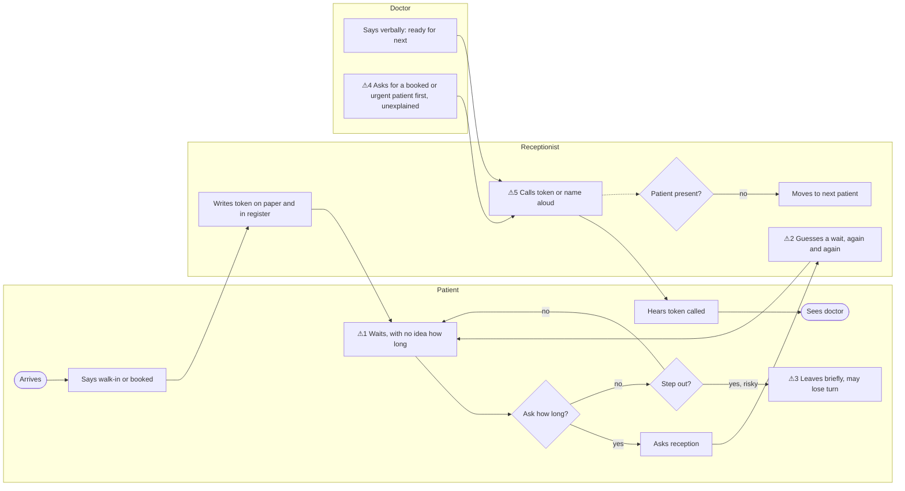
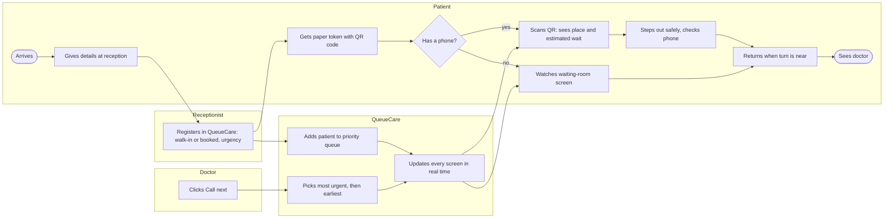
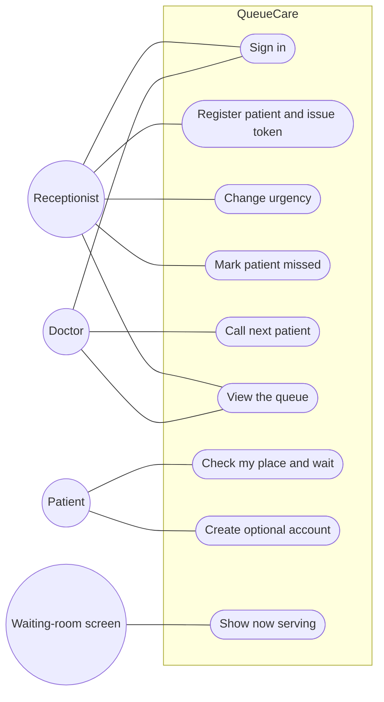

# Business Requirements Document: QueueCare

**Author:** Ahmed Malik · **Date:** 7 October 2026 · **Version:** 1.0 · **Evidence:** [stakeholder interview findings](research/interview-findings.md)

## 1. Business problem

Small private clinics in Lahore manage patients with paper tokens and a paper register. Patients cannot tell how long they will wait or whether it is safe to step out, so they ask reception repeatedly; the receptionist answers the same question all evening while also registering patients, taking calls and payments. Urgent and booked patients change the order without explanation, which causes complaints and arguments.

**Evidence (interviews, 7 October 2026):**
- All 4 participants named not knowing the wait as the main problem; the receptionist's biggest burden is answering *"aur kitni dair lage gi?"*
- Patients waited 35–70 minutes; the two who stated an expectation waited longer than they expected (P1: expected 20–30, waited 65–70 minutes).
- All 4 described patients wanting to step out but staying for fear of missing their turn; patients have lost their place.
- 15–20 patients wait at peak; 40–50 are seen on a busy evening.

**Cost to the business:** receptionist time lost to repeated questions; tension and complaints in the waiting room; a poor experience that may push patients to other clinics.

## 2. Stakeholders

| Stakeholder | Role | What they need | Influence |
|---|---|---|---|
| Receptionist | Registers patients, manages the queue, answers questions | Fewer repeated questions; fast registration; no double entry; no training needed | High |
| Doctor | Sees patients, decides on urgent cases | A simple way to call the next patient; control over urgent cases | High |
| Patient (walk-in or booked) | Waits to be seen | Know roughly how long; step out without losing their turn; understand order changes | Medium |
| Patients without smartphones | Elderly or non-technical patients | Paper token and a visible screen continue to work | Medium |
| Clinic owner | Decides whether to adopt the system | Calmer evenings, fewer complaints, low cost and effort | High |

## 3. Current process (as-is)

**Pain points** (marked ⚠ on the diagram)
1. **No wait information:** a token number alone doesn't tell a patient how long they'll wait (F1).
2. **Repeated questions:** reception guesses the wait again and again (F1, F7).
3. **Risky to step out:** an absent patient can lose their place (F2).
4. **Invisible priority changes:** booked and urgent patients appear to skip the queue, which causes complaints (F3).
5. **Manual, verbal calling:** the waiting-room TV isn't used for the queue (F4).

## 4. Future process (to-be)

**What changes:** the wait is visible on every phone and on the waiting-room screen, so reception stops guessing; patients can step out and watch their place; priority follows clear rules and is announced on screen; calling is one click.

## 5. Requirements

Priorities use **MoSCoW**: **M**ust have, **S**hould have, **C**ould have, **W**on't have (this version).

### 5.1 Business requirements

| ID | Requirement | Evidence | Priority |
|---|---|---|---|
| BR-1 | Reduce the time reception spends answering "how long will it take?" | F1, F7 | Must |
| BR-2 | Let patients use their waiting time freely without losing their turn | F2 | Must |
| BR-3 | Make changes to the queue order fair and understandable, to reduce complaints | F3 | Must |
| BR-4 | Fit the clinic's existing way of working: paper tokens, one receptionist, no training | F4, F7 | Must |
| BR-5 | Measure how accurate wait estimates are, so the clinic can trust them | F5 | Should |

### 5.2 Functional requirements

| ID | The system shall… | Linked BR | Priority |
|---|---|---|---|
| FR-1 | let receptionists and doctors sign in, and show each role only its own screens | BR-4 | Must |
| FR-2 | let the receptionist register a patient (name or initials, walk-in or booked, urgency level) and issue the next token number | BR-4 | Must |
| FR-3 | give every token a unique link and QR code to a status page that works **without signing in** | BR-1, BR-2 | Must |
| FR-4 | order the queue by urgency, then by booked time or arrival, raising priority with waiting time so nobody waits indefinitely | BR-3 | Must |
| FR-5 | let the receptionist change a patient's urgency (on the doctor's instruction) | BR-3 | Must |
| FR-6 | let the doctor call the next patient with one action, choosing the highest-priority patient | BR-3, BR-4 | Must |
| FR-7 | update the receptionist, doctor, status pages and waiting-room screen automatically when the queue changes | BR-1 | Must |
| FR-8 | show each waiting patient their token, place in the queue and an **estimated wait as a range**, based on the doctor's recent consultation times | BR-1, BR-2 | Must |
| FR-9 | show on the waiting-room screen the token now being served and the next few tokens, and **"Priority patient called"** when a patient is called out of normal order | BR-3 | Must |
| FR-10 | let the receptionist mark a called patient as missed and put them back in the queue | BR-2 | Should |
| FR-11 | let a patient optionally create an account to see their visits and bookings | BR-2 | Should |
| FR-12 | record the estimated and actual wait of every visit | BR-5 | Should |
| FR-13 | let the receptionist mark a patient as "stepped out" without losing their place | BR-2 | Could |
| FR-14 | send WhatsApp alerts when a patient's turn is near | BR-2 | Won't (v1): needs a paid messaging service |
| FR-15 | keep working fully during an internet outage | BR-4 | Won't (v1): recorded as a risk |

### 5.3 Non-functional requirements

| ID | Category | Requirement | Priority |
|---|---|---|---|
| NFR-1 | Usability | A receptionist registers a patient in **under 30 seconds** from one screen, without training | Must |
| NFR-2 | Mobile | The patient status page is usable at **375 px** width and loads in under 3 seconds on mobile data | Must |
| NFR-3 | Readability | The waiting-room screen is readable from across the room (very large token numbers) | Must |
| NFR-4 | Privacy | Public screens and status pages show **no names or medical details**; a status link reveals only its own token | Must |
| NFR-5 | Security | Each role can see and change only what it needs; enforced by the database, not just the screens | Must |
| NFR-6 | Real-time | Changes appear on all open screens within **2 seconds** | Must |
| NFR-7 | Resilience | If the connection drops, screens keep showing the last known queue and say they are reconnecting | Should |

## 6. Use cases

| Use case | Actor | Summary |
|---|---|---|
| Register patient and issue token | Receptionist | Enters name or initials, walk-in or booked, urgency; prints or writes the token; the QR code links to the status page |
| Change urgency | Receptionist | Raises or lowers a patient's priority on the doctor's instruction |
| Call next patient | Doctor | One action; QueueCare picks the most urgent, then earliest patient, and every screen updates |
| Check my place and wait | Patient | Opens the token's link (no sign-in) and sees place in queue and an estimated wait range |
| Show now serving | Waiting-room screen | Displays the current and next tokens, and "Priority patient called" when the order changes |

## 7. Assumptions and constraints

**Assumptions**
- The clinic has a computer with internet at reception and a TV or screen in the waiting area that can open a web page (confirmed by R1).
- Urgency is decided by the doctor or receptionist; **QueueCare does not make medical judgements**.
- Many but not all patients have a smartphone; paper tokens remain the fallback.
- One clinic and one doctor queue are enough for version 1.

**Constraints**
- Built and released within 3 days (8–10 October 2026) as part of a portfolio programme.
- Free tiers only (Supabase, Vercel).
- No patient medical records or payments are stored: QueueCare manages the queue, not the clinic.

## 8. Traceability matrix

Each requirement links to the user story that delivers it, the GitHub issue that tracks it and the test that verifies it.

| Requirement | User story | GitHub issue | Test |
|---|---|---|---|
| FR-1 | US-1 | [#4](https://github.com/ahmed-malikk/QueueCare/issues/4) | ST-01 |
| FR-2 | US-2 | [#5](https://github.com/ahmed-malikk/QueueCare/issues/5) | ST-02 |
| FR-3 | US-5 | [#8](https://github.com/ahmed-malikk/QueueCare/issues/8) | ST-05 |
| FR-4 | US-3 | [#3](https://github.com/ahmed-malikk/QueueCare/issues/3), [#6](https://github.com/ahmed-malikk/QueueCare/issues/6) | UT-01 to UT-06, ST-03 |
| FR-5 | US-3 | [#6](https://github.com/ahmed-malikk/QueueCare/issues/6) | ST-03 |
| FR-6 | US-4 | [#7](https://github.com/ahmed-malikk/QueueCare/issues/7) | UT-01, ST-04 |
| FR-7 | US-4 | [#7](https://github.com/ahmed-malikk/QueueCare/issues/7) | ST-04 |
| FR-8 | US-5 | [#3](https://github.com/ahmed-malikk/QueueCare/issues/3), [#8](https://github.com/ahmed-malikk/QueueCare/issues/8) | UT-07, ST-05 |
| FR-9 | US-6 | [#9](https://github.com/ahmed-malikk/QueueCare/issues/9) | ST-06 |
| FR-10 | US-7 | [#10](https://github.com/ahmed-malikk/QueueCare/issues/10) | ST-07 |
| FR-11 | US-8 | [#11](https://github.com/ahmed-malikk/QueueCare/issues/11) | ST-08 |
| FR-12 | US-9 | [#12](https://github.com/ahmed-malikk/QueueCare/issues/12) | UT-08, ST-09 |
| NFR-4 privacy | US-5, US-6 | [#8](https://github.com/ahmed-malikk/QueueCare/issues/8), [#9](https://github.com/ahmed-malikk/QueueCare/issues/9) | ST-05, ST-06 |
| NFR-5 security | US-1 | [#2](https://github.com/ahmed-malikk/QueueCare/issues/2), [#4](https://github.com/ahmed-malikk/QueueCare/issues/4) | ST-01 |

Unit (UT) and system (ST) test cases are defined in the test plan ([#13](https://github.com/ahmed-malikk/QueueCare/issues/13)). FR-13 to FR-15 are not in this version.

## 9. Sign-off

To be reviewed with the receptionist interviewed (R1) during the pilot, as the person who would use the system every day.
